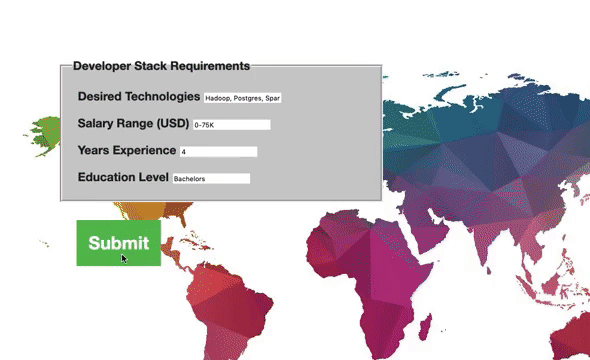

# flask_proj05

Gif demo of working app. 


Live app [hosted on Heroku](https://tech-clusters-app.herokuapp.com/) and more information on [project design and data can be found on Towards Data Science](https://towardsdatascience.com/international-talent-segmentation-for-startups-3f88cb1b6e70)

Install this: https://docs.docker.com/docker-for-mac/install/

run this:

```bash
docker-compose build dev
docker-compose up dev
```

Visit localhost:8000/ to see the app.


# A few comments
- dont keep code thats commented in your repo; generally poor form because its distracting to another developer trying to understand what your code does.
- maybe add some screenshots

- Look into jinja2 inheritance for your templates files.  https://blog.miguelgrinberg.com/post/the-flask-mega-tutorial-part-ii-templates


# linting
Its making sure your code is properly formatted.  using "black" is pretty common now:

```bash
pip install black
black flask_proj05/
```
